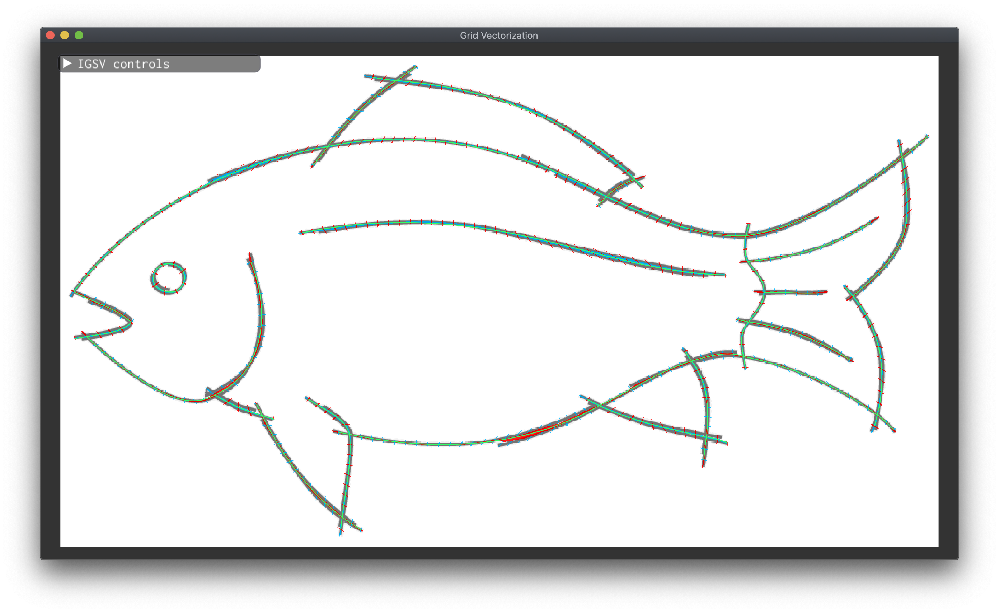

# Grid Vectorization

This repository contains the authors' C++ implementation of the paper [Integer-Grid Sketch Simplification and Vectorization](https://repo-sam.inria.fr/d3/grid-vectorization/) (SGP 2020).

The code was developed on MacOS and tested on Fedora and Windows.

## Quick start
```shell
git clone --recursive https://gitlab.inria.fr/D3/grid-vectorization.git
cd grid-vectorization
mkdir build
cd build
cmake .. -DCMAKE_BUILD_TYPE=Release -GNinja
ninja
```

## Basic usage
### Gui mode
```shell
./IGSV_bin -i ../data/fish.png -n 0.3 -s 2
```

The above command will vectorize the `fish.png` with narrow band size `0.3` and scale set to `2`.
The output will be written to `../data/fish.svg` and shown in gui:



### Local scale control using a mask

**TODO**

### Terminal mode
By default, the program will be run in gui mode. You can run the program in terminal-only mode using the `--no-gui` flag.
```shell
./IGSV_bin -i ../data/fish.png -n 0.3 -s 2 --no-gui
```
In terminal-only mode, the program will also serialize the state (`../data/fish.png.state`) along with the svg (`../data/fish.svg`).
The state can later be deserialized and shown in gui using the `--deserialize` or `-d` flag:
```shell
./IGSV_bin -i ../data/fish.png -d ../data/fish.png.state
```

## List of command line flags

| flag | default value | description |
| :--- | :---  | :---  |
| `-h, --help`  | | Show the help in command line. |
| `-i, --input` | | Input filename (bitmap) |
| `-o, --output` | | Output filename (svg) |
| `-b, --threshold` | 165 | Threhold for input image binarization. |
| `-n, --narrow-band-radius` |  0.3 |Relative radius of the narrow band (w.r.t. average stroke width). |
| `-s, --scale-multiplier` | 1.0 | Scale multiplier. Controls the scale of the grid: bigger value = coarser grid = more simplifiation. |
| `-m, --mask`  | | Mask filename (greyscale bitmap) |
| `-f, --mask-factor` | 2.0 | Scale factor for the mask. |
| `-d, --deserialize` | | If specified, the parametrization will be deserialized from a `.state` file. |
| `--no-gui` | | If specified, the program will run in terminal-only mode. The parametrization will be serialized to a `${INPUT_FILENAME}.state` file, e.g. `../data/fish.png.state`. |

## Dependencies
- included:
    - [alglib](https://www.alglib.net/)
    - [CoMISo](https://www.graphics.rwth-aachen.de/software/comiso/)
    - [simple-svg](https://code.google.com/archive/p/simple-svg/)
- submodules:
    - [Eigen](http://eigen.tuxfamily.org/)
    - [libigl](https://libigl.github.io/)
- downloaded by libigl:
    - [CGAL](https://www.cgal.org/)
    - [Triangle](https://www.cs.cmu.edu/~quake/triangle.html)

We also provide an optional gui, which is built on top of [Dear ImGui](https://github.com/ocornut/imgui), [GLFW](https://www.glfw.org/) and [Glad](https://glad.dav1d.de/).

## License
The code in this repository except for the external dependencies is provided under the GNU GPLv3 License.
The external dependencies (`ext/` folder) are provided under their respective licences.

## Contact
For any questions regarding the paper or the implementation, please contact Tibor Stanko ([tibor.stanko@inria.fr](tibor.stanko@inria.fr) or [tibor.stanko@gmail.com](tibor.stanko@gmail.com)). If you find a bug, please let us know, or submit a PR.
